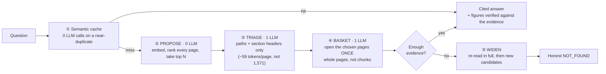

<div align="center">

# Toshokan KB

### A knowledge base organised like a library — cited answers, or an honest "I don't know"

[](https://python.org)
[](https://fastapi.tiangolo.com)
[](https://react.dev)
[](https://vite.dev)
[](https://sqlite.org)
[](https://www.linkedin.com/in/leducdat-profile)

**Ask a question. Get an answer that shows exactly where it came from — or admits the shelf is empty.**

Documents are shelved like a library (domain → shelf → book → page). Retrieval is a **cascade**: a free
embedding sieve proposes, an LLM triages on section headers, and a small basket of **whole pages** is
opened once. Every answer carries its citations. When the evidence isn't there, it says so.

Every design decision in here was **kept or killed by a measurement** — including five ideas that
sounded good and lost.

[Measured results](#measured-results) · [What we refuted](#what-we-measured-and-refuted) · [Quick start](#quick-start) · [Roadmap](#roadmap--next-steps)

</div>

---

## Why this exists

Most RAG systems make the model **passive**. They cut documents into fixed-size chunks, embed them,
retrieve top-k, and hand the model whatever came back. Two things break:

1. **Chunking strips context.** A 400-token slice loses the section it belonged to, the table it
   explained, the qualifier two paragraphs up. The model then reasons over fragments.
2. **The model has no way to say no.** Handed plausible-but-insufficient context, LLMs get *more*
   confident, not less — a documented RAG paradox. They improvise, fluently, with citations attached.

Toshokan KB attacks both. Evidence is a **whole page** at the author's own boundary, never a blind
cut. And "no evidence ⇒ an honest NOT_FOUND" is a rule enforced in code, then measured at scale.

---

## How it works — the cascade

The embedder is a **bad oracle but a great sieve** (top-1 39.3%, top-10 90.7% on our own corpus). The
LLM is the reverse: superb over a handful of candidates, ruinous per call. So use each for what it is.



The basket is the point, and it is not a compression trick: text inside the *navigator's conversation*
is re-billed every turn; text inside the *answerer's call* is billed exactly once. So the full page
never enters the conversation at all.

---

## Beyond traditional RAG

| | Traditional RAG | Toshokan KB |
|---|---|---|
| **Unit of evidence** | fixed-size chunks, context stripped | **whole pages** at the author's own boundaries |
| **Retrieval** | one vector top-k → answer | sieve wide (free) → LLM triage on headers → open a small basket |
| **Structure** | flat index | domain → shelf → book → page, with cross-references |
| **When nothing fits** | improvises from parametric memory | **honest NOT_FOUND** — 92.7% correct refusals at n=301 |
| **Numbers in the answer** | whatever the model says | every figure checked against the evidence; invented ones **stripped and shown** |
| **Multi-turn** | stuff history into the prompt — O(T²) | one lite rewrite → standalone query; the expensive call never sees history |
| **Repeat questions** | pay full price every time | **semantic cache** — 0 LLM calls on a near-duplicate |
| **Cost** | grows with conversation length | **14× cheaper** than the agentic walk it replaced, same accuracy |

---

## Measured results

> Every number below carries its regime and its `n`. Numbers without both are marketing, not evidence.

### The architecture A/B — cascade vs an agentic tree-walk

Same 30 held-out questions, same corrected judge, answers saved and re-graded.

| | Agentic walk | **Cascade (shipped)** |
|---|---|---|
| Answer accuracy | 93.3% | **93.3%** |
| Correct page | 73.3% | **90.0%** |
| Correct shelf | 93.3% | **100.0%** |
| Tokens / query | 66,558 | **4,711** |
| LLM calls | 9–13 | **2–3** |

**Identical accuracy, better routing at every level, 14× cheaper.** The walk re-sent its whole
conversation each turn — it saw 8,601 tokens of distinct information and we paid 45,268 for it.

### External benchmarks — numbers our own LLM did not author

**MultiHop-RAG** · 2,079 pages · 2,255 ground-truth queries · embeddings only, no generation:

| Index | Hit@3 | Coverage@10 | AllGold@20 | Generation cost to build |
|---|---|---|---|---|
| Generated questions | 86.7% | 81.7% | 69.5% | ~3,100,000 tokens |
| **Page text (shipped)** | **90.3%** | **87.5%** | **93.5%** | **0** |

**FiQA** · 648 human questions · verified with `pytrec_eval`: **nDCG@10 0.621**, **Recall@10 0.701**.

### Does it survive scale? (FiQA needle-in-a-haystack, model-free)

| Corpus size | R@1 | R@10 | **R@50** | **R@100** |
|---|---|---|---|---|
| 2,000 | 0.488 | 0.952 | **0.988** | **0.997** |
| 10,000 | 0.409 | 0.862 | **0.961** | **0.976** |
| 57,638 | 0.316 | 0.701 | **0.863** | **0.920** |

**The scale problem lives entirely in the narrow window.** R@1/R@10 collapse as the corpus grows;
R@50 is nearly flat from 2k → 10k. Read a wide enough window and retrieval *is* scale-invariant in
the target range — which is exactly what the cascade does.

### Honesty — the rule this project calls non-negotiable

MultiHop-RAG ships **301 questions the corpus genuinely cannot answer**. Most evals contain only
answerable questions, which quietly rewards guessing. This one punishes it.

| Metric | Result |
|---|---|
| **Honest refusals** (of 301 unanswerable) | **92.7%** |
| Answer accuracy (answerable, n=80, basket=10) | **85.9%** |
| ↳ comparison (needs 2+ documents) | 74.1% |
| ↳ temporal (needs 2+ documents) | 83.3% |
| ↳ single-document inference | 100% |
| Cowardice (wrongly gave up) | **1.4%** |

Honesty and cowardice are always reported together: a librarian who refuses everything scores 100%
honesty and is useless.

### Semantic cache calibration

Question-to-question cosine, measured on real paraphrases:

| Pair | Cosine | |
|---|---|---|
| "What is reranking in RAG?" ↔ "Explain how reranking works in a RAG pipeline" | 0.926 | want a hit |
| "What is reranking in RAG?" ↔ "what is reranking?" | 0.923 | want a hit |
| "What is reranking in RAG?" ↔ **"What is chunking in RAG?"** | **0.875** | **want a miss** |

A different topic already sits at 0.875 (the shared "in RAG" inflates it), so the threshold ships at
**0.92**: precision first, recall modest **by design**. A wrong cache hit serves the wrong question's
answer — for a cache you are meant to trust, that is the only acceptable trade.

---

## What we measured *and refuted*

Ideas that sounded right, were built, measured, and **killed**. They are listed because a system you
can trust has to show its losses too.

| Idea | Why it sounded good | What the measurement said |
|---|---|---|
| **Cross-encoder reranking** | convert a wide window into a sharp top-1 | **HURT** FiQA R@1 by 5–9 pts at every scale — a strong embedder leaves a reranker nothing to add |
| **Hybrid BM25 fusion** | lexical rescues rare terms the embedder smears | recall **down** on both query distributions; colloquial R@1 83.3% → 43.3% |
| **NMS diversification** | stop near-duplicate pages crowding the basket | **−10 pts** recall — it suppressed the right page for being *similar to* a good one, and that similarity was corroboration |
| **Page digest (compress old reads)** | plateau the conversation instead of growing it | **+17% more expensive** — robbed of the text, the librarian compensated by reading *more* |
| **Coverage-aware triage** | tell triage a multi-part question needs a page per part | answer accuracy **down**; the ceiling was basket size, not triage's smartness |
| **Query decomposition** | split a compound question, retrieve each part sharply, recombine | **LOST** comparison 74.1% → 63.0%, temporal 83.3% → 66.7% — and not from starvation: fed *more* evidence than the baseline it still lost, give-ups turning into wrong answers |

Each one is still in the tree behind a default-off knob, so any of them can be re-measured.

---

## Features

<details open>
<summary><b>Retrieval &amp; answering</b></summary>

- **Cascade retrieval** — free embedding sieve → LLM triage on section headers → open a small basket
  of whole pages once. 2–3 LLM calls per query.
- **Auto-tuned depth** — window and basket resolve from corpus size at query time (a 113-page library
  does not need the window a 57k-page one does).
- **Cite-or-abstain** — the answerer must return verbatim quotes, verified in code by fuzzy
  character-n-gram match against the real page text, not by the model's say-so.
- **Anti-fabrication gate** — every figure in an answer must exist in the evidence; invented ones are
  named, removed, and *shown to the reader* ("2 invented numbers removed").
- **Sufficiency gate** — evidence is judged *enough* before generation, on the cheap tier, so an
  insufficient context never pays for an answer call.
- **Honest NOT_FOUND** — failure is a designed outcome, never a guess.

</details>

<details>
<summary><b>Agents, routes &amp; tools</b></summary>

Home-grown runtime, but conforming to open protocols (MCP for tools, A2A-shaped agent cards, AG-UI
style event streaming). **No agent framework in the dependency tree.** Adding a capability is a
`register()` call — the orchestrator is never edited.

| Route | Handles |
|---|---|
| `search_library` | any knowledge question — the cascade (default) |
| `answer_directly` | greetings, thanks, questions about the assistant itself |
| `calculator` | arithmetic, computed by a safe AST evaluator — never `eval()`, never guessed |
| `catalog` | structural questions ("what domains do you have?") read straight from the store |
| `clarify` | a too-vague message gets **one** targeted question instead of a guess |
| `synthesize` | aggregative questions — wide scan → parallel map → one cited synthesis |

Every non-default route **defers** when its own second-stage check says the message isn't for it, so
a mis-route falls through to the cascade rather than mis-answering.

</details>

<details>
<summary><b>Conversation &amp; cache</b></summary>

- **Multi-turn chat** — a follow-up ("tell me more about it") is rewritten into a **standalone query**
  by one cheap call *before* retrieval, so the cascade stays single-shot and history never enters the
  expensive calls.
- **Persistent history** — every thread is stored; the sidebar lets you reopen, rename, pin (max 5)
  and delete, with creation timestamps.
- **Semantic answer cache** — a question that *means* the same as one already answered is served
  instantly with 0 LLM calls. Only grounded, confident, cited answers are ever cached; a NOT_FOUND
  never is. Answers are **editable** — an edited answer becomes *curated* and sticky.

</details>

<details>
<summary><b>Ingest &amp; observability</b></summary>

- **One ingest pipeline** — PDF (`pymupdf4llm`), HTML/URL (`trafilatura`), Markdown, plain text. A new
  source format costs zero lines of code.
- **Recursive structure-aware splitting** — cut at the document's own headings, recurse into an
  oversized piece at *its* structure, fall back to size only when structure runs out.
- **Back matter kept, never indexed** — a bibliography stays readable but stops being retrievable
  "evidence".
- **Observatory** — KPIs, the live trajectory feed and trace replay, computed from real logged traffic.
- **Reproducible evaluation** — `libkb eval --save` then `libkb rejudge`: answers are the expensive
  artifact, grading them is not. Three separate times the *metric* turned out to be the broken thing.

</details>

---

## Tech stack

| Layer | Choices |
|---|---|
| **Backend** | Python 3.11+, FastAPI, Pydantic v2, SQLite (WAL), NumPy |
| **Frontend** | React 18, TypeScript, Vite 6, design tokens (light + dark) |
| **Models** | Gemini (default), Qwen/DashScope, AWS Bedrock — routed by model name |
| **Retrieval** | `gemini-embedding-001`, brute-force cosine over a cached matrix |
| **Quality** | pytest (269 tests, LLM-free), ruff |

Only one module imports the model SDK, so a provider change never leaks into the agent layer.

---

## Quick start

**Requirements:** Python 3.11+, Node 18+, and a [Google AI Studio API key](https://aistudio.google.com/apikey).

```bash
git clone https://github.com/LeDat98/toshokan_kb.git
cd toshokan_kb

# 1. Backend
python -m venv .venv
.venv\Scripts\python.exe -m pip install -e ".[dev]"     # Windows
# python -m venv .venv && .venv/bin/pip install -e ".[dev]"   # macOS / Linux

# 2. Configure
cp .env.example .env          # then put your GEMINI_API_KEY in it

# 3. Seed a demo library (AI → RAG / LLM / CV)
.venv\Scripts\libkb.exe init
.venv\Scripts\libkb.exe seed

# 4. Run — two terminals
.venv\Scripts\python.exe -m uvicorn libkb.api.main:app --reload
cd web && npm install && npm run dev
```

Open **http://localhost:5173** and ask *"What is reranking in RAG?"*

### CLI

```bash
libkb ask "how do I rerank results?" --trace   # answer in the terminal, with the walk
libkb ingest <file|url>                        # add a document; the AI files it
libkb import <folder> --domain AI              # bulk import, structure-preserving
libkb reindex                                  # rebuild the card catalog
libkb eval --save                              # accuracy + honesty, answers saved
libkb rejudge <file>                           # re-grade saved answers for free
libkb probe-recall | probe-separability        # free, model-free diagnostics
```

### Configuration

<details>
<summary><b>Environment variables</b> (all optional except the API key)</summary>

| Variable | Default | What it does |
|---|---|---|
| `GEMINI_API_KEY` | — | **required** |
| `LIBKB_MODEL` | `gemini-3.5-flash` | navigation + answering |
| `LIBKB_MODEL_LITE` | `gemini-3.1-flash-lite` | classification, routing, bulk generation |
| `LIBKB_CASCADE_DEPTH` | `auto` | retrieval window — `minimum` / `default` / `deep` |
| `LIBKB_CASCADE_BASKET` | `auto` | pages the answerer opens — `10` / `20` |
| `LIBKB_ENABLE_ROUTER` | `false` | front-door routing (concierge, calculator, catalog, clarify) |
| `LIBKB_ENABLE_ANSWER_CACHE` | `true` | semantic answer cache |
| `LIBKB_ANSWER_CACHE_THRESHOLD` | `0.92` | cache hit floor — precision first |
| `LIBKB_ANSWER_REQUIRE_CITATION` | `false` | cite-or-abstain gate |
| `LIBKB_ANSWER_BAN_INVENTED` | `false` | anti-fabrication gate |
| `LIBKB_ANSWER_SUFFICIENCY_GATE` | `false` | judge sufficiency before generating |

Gates ship default-off because they were measured on specific corpora — turn them on and re-measure
on yours. That is the whole point of `libkb eval --save`.

</details>

### API

| Endpoint | Purpose |
|---|---|
| `POST /api/query` | ask a question (SSE: `nav` steps, then `answer`) |
| `GET /api/library/tree\|node\|book\|page` | browse the library |
| `POST /api/ingest` · `POST /api/import` | add documents (SSE progress) |
| `GET /api/conversations` · `PATCH` · `POST /{id}/pin` · `DELETE` | chat history |
| `GET /api/cache` · `POST /api/cache/toggle` · `PATCH` · `DELETE` | the semantic cache |
| `GET /api/observatory` | KPIs + trajectory feed |
| `GET /api/agents` · `GET /api/a2a/agent-card` | agent discovery |

---

## Roadmap — next steps

Ordered by what would make this trustworthy and adoptable, not by what is easiest.

**Trust — make the honesty machinery visible**
- [ ] **Click-to-source**: a citation opens the page with the exact grounding sentence highlighted
      (the verbatim quotes already exist server-side — they just aren't surfaced yet)
- [ ] **Feedback loop**: thumbs up/down with a reason, tied to the trajectory that produced the answer
- [ ] **Conflict detection**: when two pages disagree, present both with sources instead of silently
      picking one
- [ ] **Recency awareness**: dates in the catalog, "this source is from 2021" warnings, prefer the
      newer document when they conflict
- [ ] **Prompt-injection hardening**: the answerer reads raw document text — a poisoned page should
      not be able to talk to it

**Adoption — install in five minutes**
- [ ] `docker compose up` for the full stack, with a demo library pre-seeded
- [ ] Bring-your-own-provider through an OpenAI-compatible endpoint (covers **Ollama / local models**,
      so the documents never leave the machine)
- [ ] CI (tests + lint + web build on every PR), release packaging, contributor docs

**The learning loop — value that compounds with traffic**
- [ ] `trajectory/analyzer.py`: a failed walk names the description that lied
- [ ] Maintenance loop: eval-gated shelf split/merge with automatic revert
- [ ] Observatory panels that turn a misroute into an approved fix

**Open questions we refuse to guess at**
- [ ] Settle the vocabulary bridge — MultiHop says a text index wins, our colloquial held-out set says
      generated questions do. Measure a colloquial set at n ≫ 30 before retiring either.
- [ ] Measure the `synthesize` route the way `decompose` was measured. It ships unmeasured, and that
      is stated here rather than hidden.

---

<div align="center">

**Built on one rule: no evidence ⇒ an honest "not found", never an improvisation.**

Everything else was negotiable, and most of it was renegotiated by a measurement.

</div>
