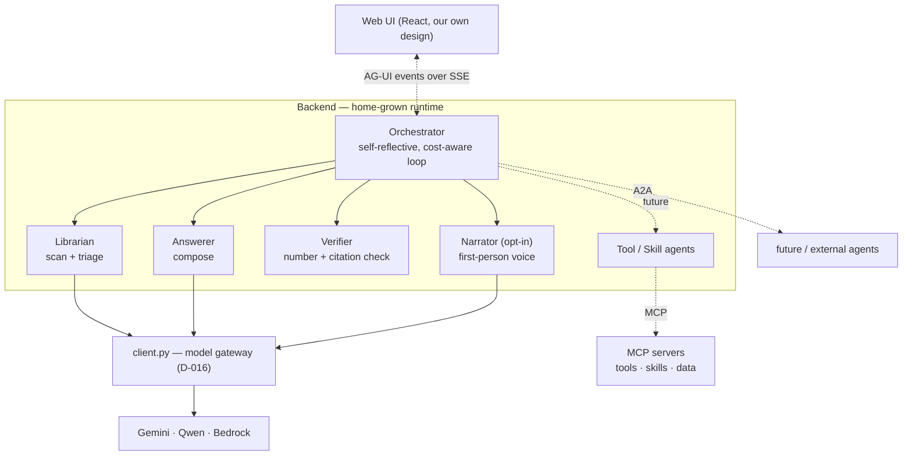
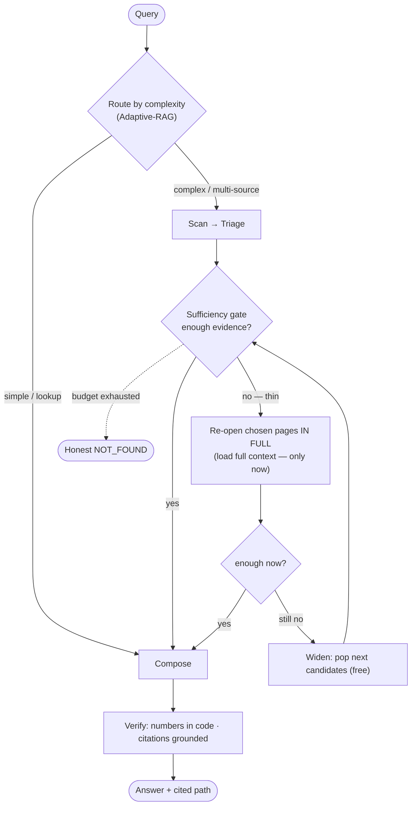

# AGENT ARCHITECTURE — a narrated, cost-aware, multi-agent orchestration

> **Status: SHIPPED (2026-07-19), default-off knobs.** Phases A–C and front-door routing are built
> and tested (203 tests). Live behind flags: narration streams on every query; `LIBKB_ENABLE_ROUTER`
> turns on the orchestrator's route decision (Concierge for greetings/meta, Calculator for compute,
> cascade as the default). Not yet committed. Check `.agent/DECISIONS.md` (D-061) before deviating.
> Durable doc, English (project convention); the user-facing pitch lives in `docs/PROPOSAL.md` (vi).

## 0. Why this exists

Today the system answers via a **cascade** (PROPOSE → TRIAGE → ANSWER, `libkb/agent/cascade.py`). It
is cheap and correct, but it runs **silently** and its shape is **fixed**. Two goals push us further:

1. **Feel like a real agent, not a script.** The UI should narrate the system's *actual* decisions in
   first person — including hesitation ("hmm, that page wasn't enough — let me read another") — and it
   should read differently for every query because the underlying decisions differ. Not four hardcoded
   labels replayed every time.
2. **Be a foundation for multi-agent.** Skills, tool-calls, and MCP servers must be addable **later
   without a rewrite or a conflict**. New agents plug in; nothing is torn down.

The tension to respect: the cascade *exists because the old agentic tree-walk was too expensive*
(O(T²), 9–13 LLM calls — see `docs/RETRIEVAL_REDESIGN.md`). Becoming "more agentic" must not
reintroduce that cost. The answer, validated by the literature (Adaptive-RAG, FLARE, Self-RAG), is:
**be agentic only when the query needs it.**

## 1. Principles (extend P1–P10)

- **P11 — Home-grown runtime, standard wire-protocols.** We do **not** adopt a heavyweight agent engine
  (LangGraph, CrewAI). We **do** conform to the three open protocols as message contracts:
  **MCP** (agent↔tools/data), **A2A** (agent↔agent), **AG-UI** (agent↔frontend). A protocol is a JSON
  shape over SSE, not a runtime — conforming needs no framework import. This is how we get genericity
  and interop **without** framework lock-in, and without reinventing the specs.
- **P12 — `client.py` stays the single model gateway (preserves D-016).** Multi-provider (Gemini, Qwen
  via DashScope, Haiku via Bedrock) is **already proven** in `client.py`; the agent layer keeps working
  in neutral types. No agent SDK becomes the model layer.
- **P13 — Agentic only when it earns it (cost-aware, Adaptive-RAG).** Simple queries stay on the cheap
  single-pass cascade. Only complex / uncertain queries escalate into the reflective loop and load full
  context. Escalation is a **measured decision**, not a default.
- **P14 — Narration reflects real decisions, and is near-free.** A "thought" is emitted by **piggybacking
  on LLM calls we already make** (triage, sufficiency, answer return a `thought` field) — ~0 extra cost.
  A dedicated narrator agent is an **opt-in** upgrade, not the baseline.
- **P15 — Honesty is not traded for UX.** Answers are **not** token-streamed from the backend: the
  anti-fabrication gate (D-057) must see the whole answer before any of it shows. The UI reveals the
  finished, verified answer client-side. Fail-closed, cite-the-path, honest NOT_FOUND all hold.
- **P16 — No framework in the dependency tree.** Pydantic AI / OpenAI Agents SDK may be run as a
  **throwaway reference spike** to compare DX, but must not enter `pyproject.toml`. UI design stays
  100% ours — the protocols touch only the backend event stream, never how the UI looks or behaves.

## 2. The agents (roles)

Each agent is a **typed role** with a uniform contract: it takes a request, may call the model gateway
and/or tools, **emits thought/step events**, and returns a typed result. "Add an agent" = implement the
contract + register it. Nothing else changes.

| Agent | Job | Model call? | Emits |
|---|---|---|---|
| **Orchestrator** | Decides the ROUTE per message, runs the loop, owns the event stream | **1 lite (route)** + coordinates | run/step/state events |
| **Librarian** | Scan (free vector propose) + Triage (pick the basket) | 1 (triage) | thought + candidate/basket events |
| **Answerer** | Compose the cited answer from the basket; self-judge sufficiency | 1 (answer) | thought + answer event |
| **Verifier** | Code-checked number verification + citation grounding (D-055/D-057) | 0 (code) | thought + verify event |
| **Narrator** *(opt-in)* | Turn raw state → first-person voice with hesitation | 1 lite (optional) | thought events |
| **Concierge** *(route)* | Answer greetings/meta directly from persona + a true library overview — no retrieval | 1 lite | thought + answer |
| **Calculator** *(route + tool, C.2)* | Compute arithmetic deterministically (safe eval), routed here for COMPUTE requests | 1 lite (extract) | thought + answer |
| **Tool / Skill agents** *(MCP, C)* | Any MCP tool → CapabilityAgent, dispatched by the registry | tool-capable model | tool-call events |

## 3. The control loop (self-reflective, cost-aware)

The loop is **the cascade's already-real branches, made explicit and narrated**. We are wrapping, not
rewriting: `cascade.py` already does propose → triage → "insufficient? re-open in full → widen → last
resort". That *is* the Self-RAG sufficiency loop; today it is silent.

**Every diamond is a narrated decision.** The route choice, the sufficiency verdict, the "re-open in
full", the "widen" — each emits a first-person thought (§5). Because *which* branches fire depends on
the query, the narration is naturally different every time.

**Cost-awareness = the escalation ladder.** Context is loaded in tiers, and the expensive tier is
entered **only** when the cheap one left the answerer uncertain (FLARE's "retrieve only when unsure"):

| Tier | What loads | Cost | Entered when |
|---|---|---|---|
| 0 | Path + section headers (triage card) | ~59 tok/page | always |
| 1 | Chosen sections of basket pages | medium | default answer |
| 2 | **Full page(s)** | high | sufficiency gate says the sections weren't enough |
| 3 | More candidates (widen) | high | still insufficient after tier 2 |

This is exactly the user's requirement — *"know when to load full context and when not."* Adaptive
routing (P13) means simple queries never leave tier 0–1.

## 4. Protocols at the seams (implemented home-grown, to spec)

- **AG-UI (agent↔frontend).** Replace the ad-hoc `nav`/`answer` SSE events with an **AG-UI-shaped typed
  event vocabulary**: `RUN_STARTED`, `STEP_STARTED/FINISHED`, `THOUGHT` (our narration), `TOOL_CALL_*`,
  `STATE_DELTA`, `TEXT_MESSAGE`, `RUN_FINISHED`, `ERROR`. The frontend consumes a stable contract; the
  UI's look stays entirely ours; future agents render in the same stream. `libkb/api/events.py` owns the
  types; `web/src/api.ts` mirrors them (the D-018 contract discipline).
- **MCP (agent↔tools/data).** A small MCP **client** lets any MCP server plug in as tools an agent can
  call. It maps onto the **existing neutral `ToolSpec`/`ToolCall`** abstraction (D-016) — MCP tool
  definitions become `ToolSpec`s; results become `ToolResponse`s. No new tool protocol invented.
- **A2A (agent↔agent).** Agents carry an **A2A-shaped descriptor** (an "agent card": id, skills, I/O
  schema). Internally this is just our registry; externally it means a future/3rd-party agent that
  speaks A2A can be delegated to without touching the loop.

## 5. Narration — natural, real, near-free

The narration is the agent's **actual reasoning**, not decoration. Two production levels:

- **Baseline (default, ~0 extra cost):** the triage / sufficiency / answer prompts each return a short
  first-person `thought` alongside their structured output. These are LLM calls we already pay for, so
  the thought is free. The free scan step gets a data-seeded line ("Scanning N pages for …", built from
  the real candidate count + top shelf).
- **Rich (opt-in toggle):** a **Narrator** agent (lite tier) voices the raw state with hesitation
  ("hmm, page X looks thin — reading one more"). ~1 cheap call per narrated decision; behind a setting,
  off by default so eval runs stay cheap.

Honesty rule for narration (P15): it must describe **what actually happened** — real paths, real counts,
real branch taken. No invented progress.

## 6. UI (patterns learned, design ours)

The thinking UI adopts **patterns** from the reference study of NexusRAG (`frontend/` — the user's own
repo), re-implemented in LibraryKB's own idiom (inline styles + `tokens.css` + our `Icon` set + CSS
keyframes). We copy patterns, not code (different stack: Tailwind/Framer vs our inline-style system).

- **Vertical timeline, not a spinner.** Each step = icon node + connector + narration line + a **live
  timer that freezes into a duration** on completion.
- **Auto-collapse to a one-line summary the moment the answer event arrives** (re-expandable). The
  single best trick for "show the work without clutter" — fits the active-seeker ethos.
- **Narration lines are the step content** (dynamic, from §5), not fixed labels.
- **NOT_FOUND is a first-class terminal node** (honest, not an error).
- **Answer rendering:** client-side reveal of the whole verified answer (P15) with block-based markdown
  for smoothness; **citations as inline chips** keyed to the walk path (clicking flashes the source).

## 7. Model strategy (keeps multi-provider + cost)

- The **orchestration loop is driven by structured JSON**, not native tool-calling — so it runs on
  **every** provider (Gemini, Qwen, Bedrock), exactly as the cascade does today. Multi-provider is
  preserved for free.
- **Native tool-calling is Gemini-only here** (D-027). So MCP tool invocation (Phase C) **escalates to a
  tool-capable model only when a tool is actually called**, and stays on the cheap structured-JSON path
  otherwise. Cost-aware by construction.

## 8. Phased roadmap

Each phase ships behind a flag, keeps the cascade working, and carries a **falsifiable check** (the
project's discipline: measure before believing).

### Phase A — Narrated self-reflective loop (no new deps) ✅ SHIPPED
Wrap the existing cascade branches in an explicit orchestrator that emits AG-UI-shaped events with
first-person thoughts (baseline, piggybacked). Make the sufficiency gate explicit and narrated. Add
adaptive routing (simple vs complex). Build the inline thinking-timeline UI + answer reveal.
- **Files:** new `libkb/agent/orchestration/loop.py` (or evolve `orchestrator.py`); `cascade.py`
  emits richer events; `api/events.py` + `api/routes.py` gain the AG-UI event types; `web/src/api.ts`
  mirrors them; new `web/src/components/ThinkingTimeline.tsx`; `Ask.tsx` swaps the "walking…" line for
  it.
- **Falsifiable check:** on the held-out set, **simple-query cost and latency do NOT regress** vs the
  current cascade (routing must keep them on the cheap path), and honesty metrics (P6, D-057) hold.
  If narration adds measurable cost to simple queries, the routing is wrong.

### Phase B — Agent roles + generic Orchestrator ✅ SHIPPED
Refactor the loop's inline steps into typed **agent roles** (Librarian, Answerer, Verifier, Narrator)
behind one interface + a **registry**. Give each an **A2A-shaped descriptor**. The Orchestrator becomes
generic: adding an agent = register it, no loop surgery.
- **Files:** `libkb/agent/roles/*.py`, a registry, `orchestration/loop.py` becomes role-driven.
- **Falsifiable check:** a **throwaway 5th agent** (e.g. a no-op "summarizer") can be registered and
  invoked **without editing the orchestrator** — proves the seam is real, not cosmetic.

### Phase C — Tools / Skills / MCP + A2A ✅ SHIPPED (C.1 seam; C.2 calculator route)
The **MCP seam** (`libkb/tools/mcp.py`): any MCP tool → a `CapabilityAgent` (registry-dispatchable)
+ a neutral `ToolSpec`. `mcp` is an OPTIONAL dep; the seam is testable with a local callable. The
**A2A** descriptor endpoint (`/api/a2a/agent-card`) exposes us for discovery.
- **C.2 (shipped):** a **calculator** skill (`libkb/tools/calculator.py`) — a deterministic `safe_eval`
  (an AST walk, never `eval()`), exposed as a dispatchable tool AND a compute ROUTE. The router sends
  COMPUTE requests to it (cost-gated); it returns None to defer to the library on a mis-route.
- **Falsifiable checks (met):** a new tool/route plugs into the registry and dispatches with **zero**
  orchestrator edit (tests); the cheap path for tool-free queries is untouched.

### Front-door routing (D-061) ✅ SHIPPED — the orchestrator's own job
The orchestrator decides, per message, which capability handles it — registry-driven (any card with a
`route_when` is a choice), **biased to the library** (a knowledge question is never answered from the
model's memory, P6), failing to the cascade on any error. Layer-0 (code) catches trivial greetings
free; Layer-1 is one lite structured-JSON call (all providers). Behind `LIBKB_ENABLE_ROUTER`
(default-off, measured knob). This subsumes "social vs cascade vs tool" into ONE decision, so a new
route/tool becomes selectable by registering — no decision-code change.

## 9. Open decisions to lock (in `.agent/DECISIONS.md` when approved)

1. **Runtime = home-grown, protocols = MCP/A2A/AG-UI to spec; no framework in deps** (Pydantic AI only
   a throwaway reference). ← the load-bearing decision.
2. **`client.py` remains the model gateway** (D-016 stands); loop is structured-JSON, multi-provider.
3. **Narration baseline = piggybacked thoughts (near-free); Narrator agent = opt-in.**
4. **Answers are not backend-token-streamed** (P15); client-side reveal after full verification.
5. Add explicit backend `reading`/`verifying` steps? — optional polish; decide in Phase A once the
   timeline exists.

## 10. Explicitly NOT doing (guard against scope creep / NIH)

- Not adopting LangGraph / Pydantic AI / any agent engine as runtime.
- Not token-streaming unverified answers.
- Not rewriting the cascade — we wrap its real branches.
- Not adding per-domain retrieval quotas yet (only if domain bias is *measured*, see PROPOSAL §8 Q1).
- Not building a bespoke tool/agent/UI protocol — we speak MCP/A2A/AG-UI instead.

## 11. Reference

Techniques: Self-RAG (self-reflective retrieval), FLARE (retrieve-when-uncertain), Adaptive-RAG /
Cost-Aware Query Routing (route by complexity), ReAct (thought/action traces). Protocols: MCP
(tools/data), A2A (agent interop, Linux Foundation), AG-UI (agent↔UI event stream). Reference SDK
(not a dependency): Pydantic AI (lightweight, model-agnostic, native MCP/A2A/AG-UI) — evaluated for
DX comparison only.
