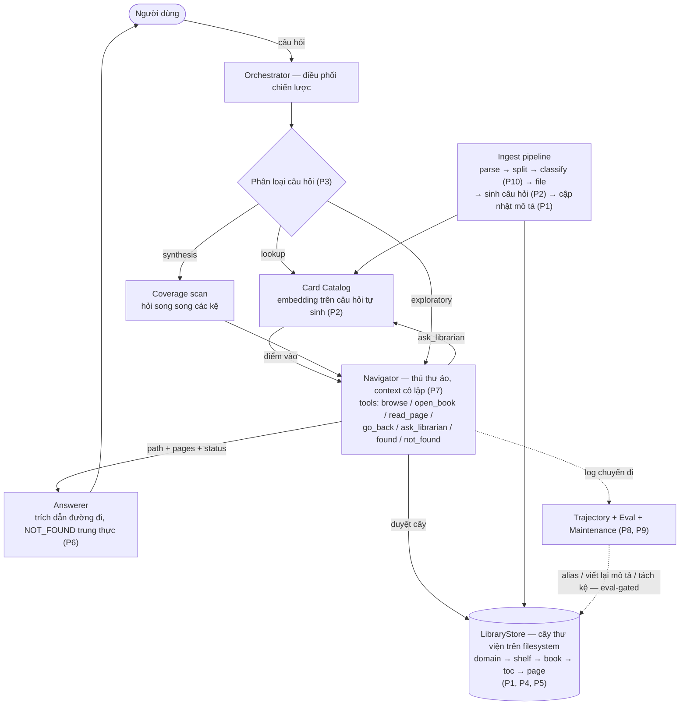
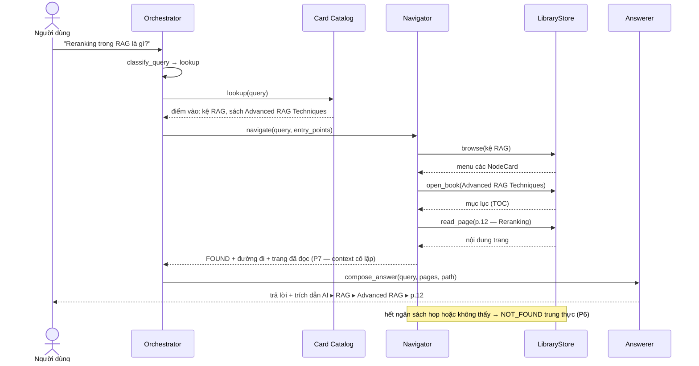
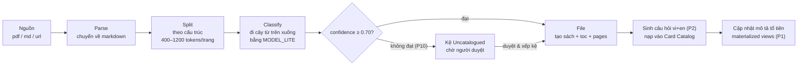
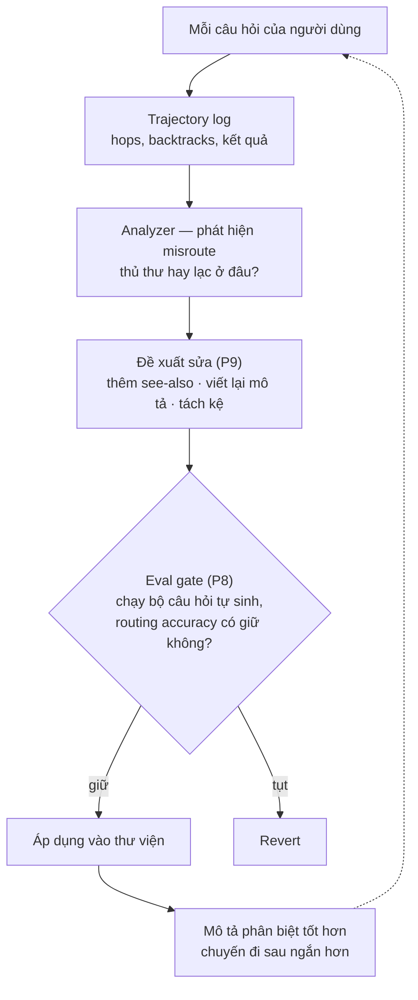

# LibraryKB — Kiến trúc hệ thống

> Một knowledge base AI được tổ chức như **thư viện vật lý**. AI không "tra một chỉ mục" —
> nó **đi bộ trong thư viện**: sảnh lĩnh vực → kệ → quyển sách → mục lục → trang.
> Hai yêu cầu sáng lập: (1) AI là **người tìm kiếm chủ động**, không phải người tiêu thụ
> similarity thụ động; (2) truy xuất **chia tầng** — context được nạp dần, không bao giờ đổ cả khối.

> 💡 Để xem sơ đồ Mermaid trong VS Code preview, cài extension **Markdown Preview Mermaid Support**
> (`bierner.markdown-mermaid`). Trên GitHub, sơ đồ tự render.

## 1. Mười nguyên tắc lõi (chốt qua 2 vòng phân tích)

Đây là các nguyên tắc chịu lực. Không được vi phạm tùy tiện; mọi thay đổi phải ghi vào
`.agent/DECISIONS.md`.

| # | Nguyên tắc | Hệ quả |
|---|-----------|--------|
| P1 | **Trang (lá) là nguồn chân lý duy nhất.** Mọi mô tả tầng trên (tóm tắt sách, thẻ kệ, thẻ lĩnh vực, one-line trong TOC) là *materialized view* — tái sinh từ các con, không bao giờ vá tay. | Luôn rebuild lại được toàn bộ; summary drift bị loại trừ từ thiết kế. |
| P2 | **Bánh đà câu hỏi.** Lúc nạp, mỗi trang được sinh 3–5 câu hỏi (VI + EN) mà nó trả lời được. Một artifact, bốn công dụng: bộ eval định tuyến, điểm vào O(1) (card catalog), cầu nối từ vựng người dùng ↔ taxonomy, regression test cho mọi lần refactor cây. | Mỗi lần nạp tài liệu làm hệ thống thông minh hơn và đo được. |
| P3 | **Bộ phân loại câu hỏi ở cửa.** `lookup` / `synthesis` / `exploratory` quyết định chiến lược truy xuất. Không tồn tại một chiến lược duyệt duy nhất tốt cho cả ba. | Lookup đi tắt qua catalog; synthesis quét coverage map-reduce; exploratory đi bộ từ gốc. |
| P4 | **Kho lưu trữ là cây nghiêm ngặt; liên kết chéo là alias không con.** Mỗi nội dung một vị trí chính tắc; `see-also` chỉ là con trỏ. | Lan truyền cập nhật vẫn là phép toán trên cây (không dính diamond problem). |
| P5 | **ID node bất biến, không bao giờ tái sử dụng. Move/split để lại redirect** (kiểu HTTP 301). | Cache, trích dẫn và trí nhớ của agent sống sót qua các lần refactor. |
| P6 | **Trạng thái kết thúc trung thực + trích dẫn đường đi.** Mọi câu trả lời kèm lộ trình (`Lĩnh vực ▸ Kệ ▸ Sách ▸ p.N`). `NOT_FOUND` là kết quả hạng nhất, hiển thị cho người dùng — không bao giờ bịa khi không có trang làm bằng chứng. | Khả năng kiểm toán là lợi thế sát thủ so với RAG phẳng. |
| P7 | **Navigator được cô lập context.** Nó đi bộ trong context riêng và chỉ trả về `(path, pages, status)`. Context của người trả lời không bao giờ thấy các menu đã bị loại. | Không ô nhiễm context; ngân sách token trung thực. |
| P8 | **Refactor cây phải qua cổng eval.** Split/merge/move chạy bộ eval định tuyến (từ P2) trước/sau; tụt điểm ⇒ revert. Rebalance offline, theo lô. | Taxonomy tiến hóa được mà không âm thầm phá định tuyến. |
| P9 | **Alias và viết lại mô tả là demand-driven** — sinh từ misroute quan sát được trong trajectory log, không sinh phỏng đoán. | Liên kết chéo ít mà hữu dụng; mô tả giữ được tính phân biệt. |
| P10 | **Nạp tài liệu có cổng confidence.** Phân loại dưới ngưỡng đi vào kệ `_uncatalogued` chờ duyệt, không bao giờ ép xếp. | Sách xếp nhầm (lỗi vĩnh viễn, âm thầm) bị chặn ngay tại cổng. |

## 2. Sơ đồ tổng quan hệ thống



Điểm mấu chốt của sơ đồ: **embedding (Card Catalog) không phải xương sống mà là "thủ thư trực bàn"** —
gợi ý điểm vào và làm lưới an toàn (`ask_librarian`); quyết định cuối cùng luôn là Navigator
đọc mô tả và tự chọn nhánh.

## 3. Một chuyến tra cứu điển hình (lookup)



Ngân sách được **thực thi trong code tầng tool, không phải trong prompt** (D-008):
`MAX_HOPS=12`, `MAX_PAGES_PER_NAV=6`, `ask_librarian ≤ 2` mỗi chuyến, visited-set chống đi vòng.

## 4. Bố cục lưu trữ trên đĩa

```
library/
  _meta.json                     # thẻ node gốc
  domains/
    ai/
      _meta.json                 # NodeMeta: id, title, description(rev), stats, see_also
      shelves/
        rag/
          _meta.json
          shelves/               # kệ được phép lồng nhau (sinh ra từ các lần tách kệ)
          books/
            advanced-rag-techniques/
              _meta.json         # thẻ sách: tóm tắt, nguồn, thông tin ingest
              toc.json           # chương → trang: {page_id, title, one_line, keywords}
              pages/
                001-what-is-rag.md
                012-reranking.md
  _uncatalogued/                 # hàng chờ duyệt (P10)
  _catalog/
    catalog.db                   # SQLite: câu hỏi+embedding, redirect, trajectory, eval runs
```

Chọn markdown + JSON trên filesystem là **có chủ đích**: con người đọc/duyệt được bằng mắt,
version được bằng git, và bản thân thư viện *chính là* ẩn dụ lưu trữ của nó. SQLite chỉ giữ
dữ liệu nhị phân/tái sinh được (gitignore).

## 5. Chiến lược theo loại câu hỏi

| Loại | Đường đi | Mục tiêu latency |
|------|----------|------------------|
| `lookup` | catalog.lookup(query) → top điểm vào → navigate có gợi ý (xác minh + đọc) → trả lời | ≤ ~5 s |
| `synthesis` | coverage scan: hỏi rẻ song song từng node đỉnh "có nội dung về X không?" → navigate từng nhánh trúng (song song, có trần) → tổng hợp kèm trích dẫn theo nhánh | ≤ ~20 s |
| `exploratory` | đi bộ đầy đủ từ gốc, ngân sách đọc rộng hơn, beam ≤ 2 khi hai nhánh sát điểm | best-effort |

Thang fallback (mọi loại): navigation `NOT_FOUND` → kiểm tra nhanh catalog.nearest_pages →
trả lời `NOT_FOUND` trung thực kèm danh sách kệ gần nhất (P6).

## 6. Pipeline nạp tài liệu



Confidence của cả chuỗi = **min qua các tầng** (mắt xích yếu nhất quyết định). Nạp lại cùng
nguồn (trùng content hash) sẽ cập nhật tại chỗ, không tạo bản sao.

## 7. Vòng lặp tự cải thiện (learning loop)



Đây là lý do **chỉ mục thật sự của hệ thống là chất lượng các bản mô tả ở mỗi node**, không phải
embedding — và vòng lặp này là cơ chế rẻ nhất để chúng tốt dần theo thời gian sử dụng.

## 8. Model & ngân sách

Toàn bộ model cấu hình qua `.env` (xem `.env.example`); mặc định:

| Biến | Mặc định | Dùng cho |
|------|----------|----------|
| `LIBKB_MODEL` | `gemini-3.5-flash` | navigator, answerer, tổng hợp synthesis |
| `LIBKB_MODEL_LITE` | `gemini-3.5-flash` | phân loại câu hỏi, phân loại tài liệu, sinh câu hỏi, tái sinh mô tả |
| `LIBKB_EMBED_MODEL` | `gemini-embedding-001` | embedding cho card catalog |

Về sau việc gán model mạnh/yếu phải theo **độ khó đo được của từng node** (accuracy per-node từ
bộ eval), không theo độ sâu của cây (D-003). Ngân sách cứng nằm ở tầng tool, không nằm trong prompt.

## 9. Tư thế scale

Cold start (< ~200 tài liệu): cây 1–2 tầng, chuyến đi ngắn tự nhiên; bộ máy tách kệ / alias /
eval nằm im (ngưỡng trong config). **Cùng một bộ tool chạy y hệt ở độ sâu 1 lẫn độ sâu 5** —
cơ chế bật dần theo kích thước, code path không đổi.

Các điểm nóng khi lớn dần và van xả tương ứng: lỗi định tuyến tích lũy → eval P2 + viết lại mô tả
P9; menu phình → branching factor 10–50 với tách kệ P8; latency → đi tắt qua catalog (P2) + gán
model theo node; mô tả cũ kỹ → rebuild P1.

## 10. Ghi chú bảo mật

Nội dung sách là **input không tin cậy** (có thể nạp từ web). Navigator phải coi chữ trong trang
là dữ liệu: các câu lệnh prompt-injection nằm trong trang không bao giờ được phép đổi hướng
chuyến đi hay thay đổi hành vi tool. Nội dung trang chỉ được đưa cho *answerer* trong khối
bằng chứng có ranh giới rõ ràng.

## 11. Các phase triển khai

| Phase | Mục tiêu | Chứng minh | Trạng thái |
|-------|----------|------------|------------|
| P0 | Scaffold: config, LLM client, store skeleton, seed | Gọi Gemini được; CRUD cây được | ✅ xong (commit `b7b0dfc`) |
| P1 | **Walking skeleton**: navigator + tools + `POST /api/query` (SSE) + nối chat UI | Vòng lặp lõi chạy end-to-end thật | ⬜ tiếp theo |
| P2 | Ingest pipeline + bánh đà câu hỏi + card catalog + đi tắt lookup | P2/P10 sống | ⬜ |
| P3 | Phân loại câu hỏi + synthesis map-reduce + trajectory log + eval runner | P3/P6/P8 đo được | ⬜ |
| P4 | Maintenance (tách/gộp kệ, alias demand-driven) + Observatory nối số liệu thật | Vòng lặp P8/P9 khép kín | ⬜ |
| UI | Mockup Claude Design → app `web/` (4 màn hình, walk engine, light/dark) | Giao diện đầy đủ trên mock data | ✅ xong (commit `020e568`) — chờ wire per phase |
