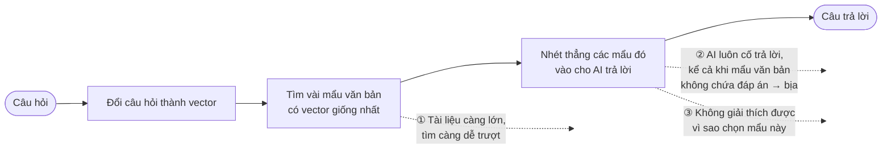
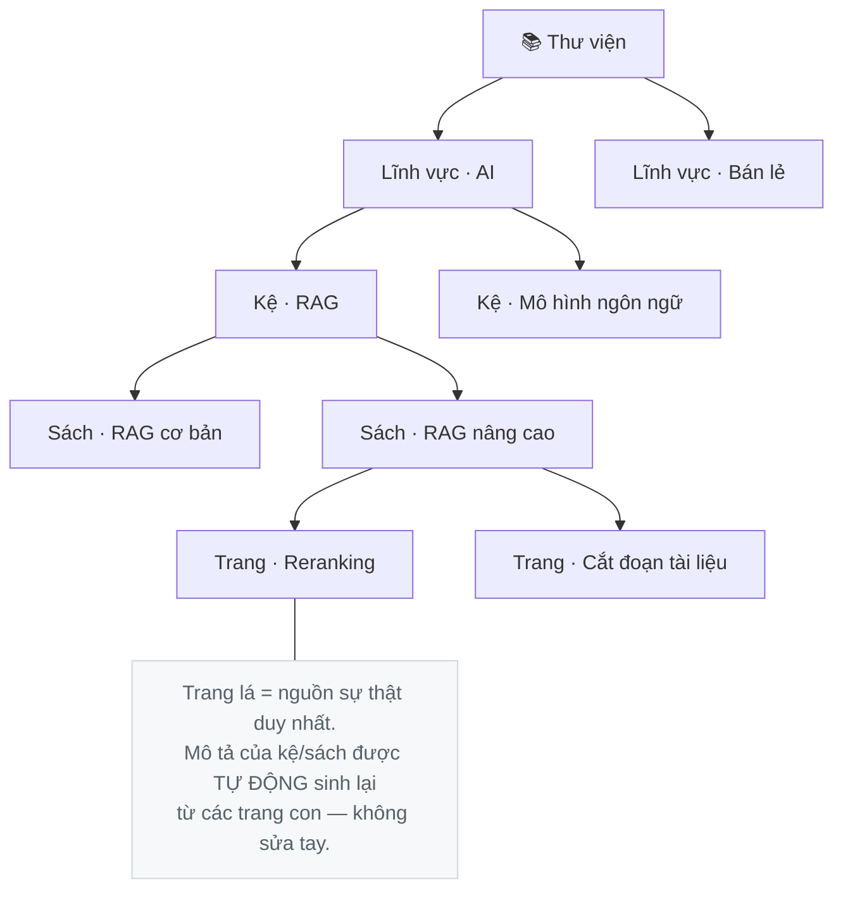
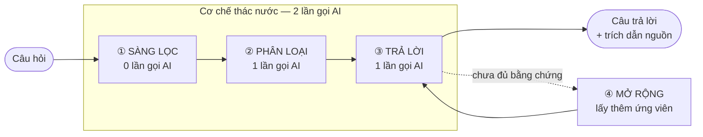
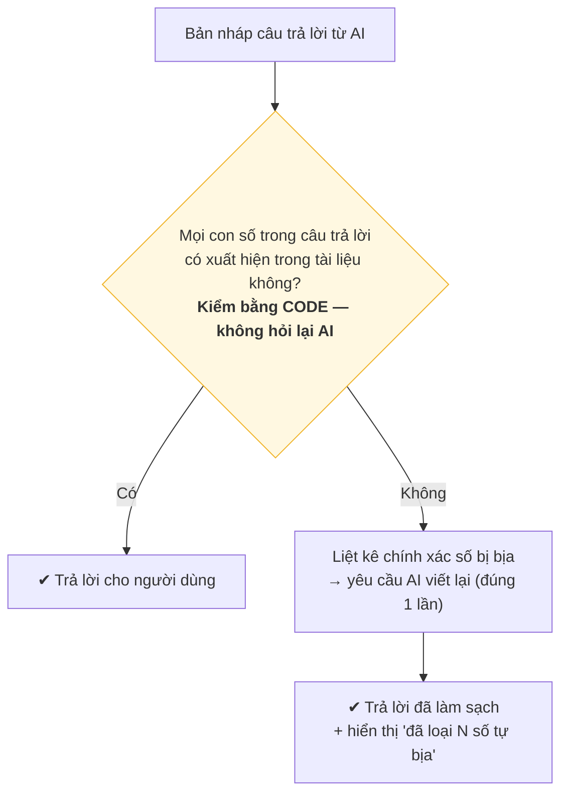
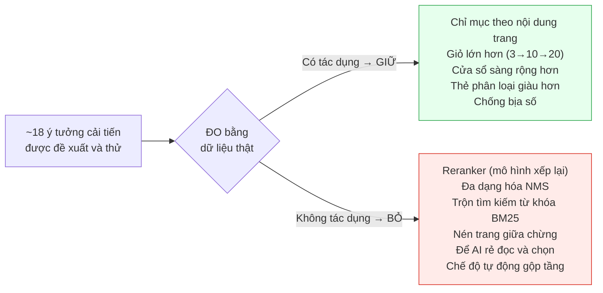
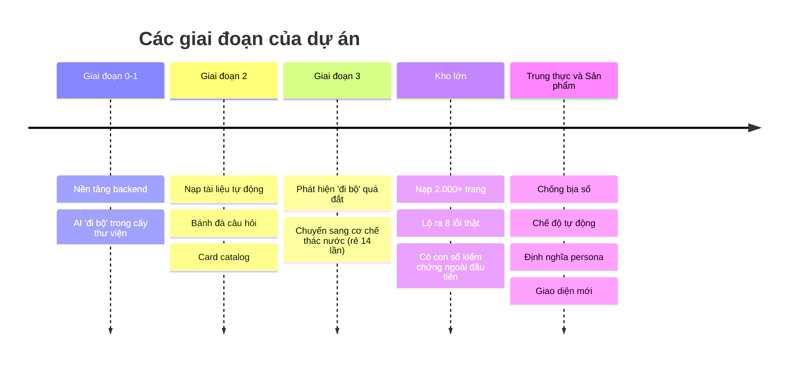

# LibraryKB — Đề xuất dự án

> Một cơ sở tri thức cho AI, được tổ chức như một **thư viện thật**: AI *chủ động đi tìm* câu trả lời
> theo tầng (lĩnh vực → kệ → sách → trang), thay vì chỉ so khớp vector một lần rồi trả lời.

**Đối tượng đọc:** người quản lý, khách hàng, và kỹ sư mới tham gia. Tài liệu viết cho người chưa
biết chi tiết kỹ thuật — mọi thuật ngữ đều được giải thích ngay khi xuất hiện.

**Nguyên tắc trình bày:** mọi con số trong tài liệu này đều đi kèm *quy mô mẫu* (`n`), *mô hình* và
*bộ dữ liệu* đã dùng để đo. Đây cũng chính là kỷ luật cốt lõi của dự án — không có con số nào là
trang trí.

---

## 1. Tóm tắt trong một phút

**Vấn đề.** Cách phổ biến để cho AI trả lời dựa trên tài liệu (gọi là RAG — *Retrieval-Augmented
Generation*, "sinh câu trả lời có tra cứu") biến AI thành một cỗ máy **bị động**: một bộ tìm kiếm cắt
tài liệu thành **mẩu nhỏ (chunk)**, chọn vài mẩu *trông giống* câu hỏi, rồi nhét thẳng cho AI trả
lời. AI không được đi tìm thêm, không được từ chối mẩu lạc đề, cũng không chủ động biết khi nào nên im
lặng. Kèm theo đó là ba nút thắt: (1) tài liệu càng lớn càng dễ tìm trượt, (2) AI hay bịa khi mẩu
được đưa không chứa đáp án, (3) khó giải thích vì sao chọn mẩu đó.

**Giải pháp.** Tổ chức tri thức thành một **thư viện có tầng** và cho AI hành xử như một **thủ thư chủ
động**: sàng nhanh để chọn ứng viên, đọc lướt tiêu đề các mục để chọn ra "giỏ" trang cần đọc, rồi mở
giỏ đó — **là những TRANG THÔ nguyên vẹn, không phải mẩu chunk bị cắt** — để soạn câu trả lời **có
trích dẫn đường dẫn**. Nếu không có bằng chứng, thủ thư **thành thật nói "chưa có"** thay vì bịa.

**Kết quả chính đã đo được:**

| Điều đã chứng minh bằng số | Con số |
|---|---|
| Bản chạy thật hiện tại | **96,7%** đúng · `n=30` |
| Chất lượng tìm kiếm **ổn định** khi kho phình 2.000 → 57.000 trang (đọc cửa sổ rộng) | 0,99 → 0,86 |
| Tỉ lệ **thành thật từ chối** khi câu hỏi không có đáp án | **92,7%** · `n=301` |
| Cơ chế **chống bịa số**: tỉ lệ bịa giảm | **37% → 7%** · `n=26` |
| Chi phí mỗi câu hỏi **nhẹ và ổn định** | ~4.700 token · 2–3 lần gọi AI · `n=30` |

So với một hệ RAG thông thường, hai khác biệt cốt lõi là: Agent **đọc cả trang gốc và chủ động chọn**
(không nhận chunk cắt vụn một cách bị động), và hệ thống **thành thật** khi không có đáp án (thành thật
từ chối + chống bịa số).

---

## 2. Vấn đề: Agent bị động, và những nút thắt kéo theo

### 2.1 Gốc rễ: AI chỉ được NHẬN, không được ĐI TÌM

Cách phổ biến hiện nay (RAG) xây dựng AI thành một người **bị động**. Một cỗ máy tìm kiếm bằng vector
cắt tài liệu thành **mẩu nhỏ (chunk)**, chọn vài mẩu *trông giống* câu hỏi nhất, rồi **nhét thẳng**
cho AI. Trong mô hình đó, AI **không có quyền**:

- đi tìm thêm khi thấy bằng chứng chưa đủ,
- từ chối một mẩu lạc đề mà bộ tìm kiếm lỡ đưa vào,
- hay chủ động nói "tôi chưa có đáp án" một cách có kiểm soát.

AI trả lời bằng đúng những gì được đưa — dù thứ được đưa là đúng, sai hay thiếu. **Sự thiếu chủ động**
này nằm ở gốc của mọi vấn đề bên dưới.

Tệ hơn, mỗi **chunk chỉ là một lát cắt** của trang: câu nêu vấn đề rơi vào mẩu này, phần giải thích
rơi vào mẩu kia. Cắt xong thì **ngữ cảnh xung quanh biến mất** — AI đọc một mẩu mồ côi và phải đoán
phần còn thiếu.

Hình dưới mô tả cách làm phổ biến và ba chỗ nó gãy.

### 2.2 Ba nút thắt kéo theo — đều đã ĐO, không phải giả định

- **Nút thắt ① — Càng nhiều tài liệu, càng dễ tìm trượt.** Trên bộ dữ liệu chuẩn quốc tế FiQA (57.638
  tài liệu, 648 câu hỏi do *người thật* viết), nếu chỉ lấy 10 mẩu gần nhất thì **cứ 10 câu có 3 câu
  đáp án nằm ngoài top-10** (R@10 = 0,70).
- **Nút thắt ② — AI bịa khi mẩu không chứa đáp án.** Trên câu hỏi mô phỏng người dùng thật hỏi lĩnh
  vực bán lẻ, AI có xu hướng **bịa con số cụ thể** (ví dụ: tài liệu nói "tỉ lệ hết hàng dưới 1%" nhưng
  AI trả lời thành "1,5%").
- **Nút thắt ③ — Không giải thích được.** Vector chỉ cho biết "giống", không cho biết "vì sao" — nên
  rất khó kiểm tra và sửa khi sai.

---

## 3. Ý tưởng: tổ chức tri thức như một thư viện

Thay vì một đống mẩu văn bản phẳng, tri thức được xếp thành **năm tầng** giống thư viện thật.

**Hai yêu cầu nền tảng của dự án:**

1. **AI là người chủ động đi tìm** (active seeker), không phải chỉ nhận một danh sách mẩu văn bản.
2. **Ngữ cảnh nạp dần** (progressive loading): không bao giờ đổ cả kho vào cửa sổ của AI cùng lúc —
   đọc tới đâu tốn tới đó.

**Quy tắc bất di bất dịch:** *trang lá là nguồn sự thật duy nhất*. Mô tả của mỗi kệ, mỗi sách đều là
"khung nhìn" được sinh lại tự động từ các trang con — không ai sửa tay, để tránh mô tả bị lệch dần
theo thời gian.

---

## 4. Kiến trúc: cơ chế "thác nước" (cascade)

Đây là trái tim của hệ thống. Một câu hỏi đi qua ba bước, nhưng **chỉ tốn 2 lần gọi AI**.

**Ba bước làm gì:**

- **① Sàng lọc** *(0 lần gọi AI)* — xếp hạng mọi trang bằng vector, đề cử ~50 trang ứng viên. Miễn phí.
- **② Phân loại** *(1 lần gọi AI)* — thủ thư đọc lướt đường dẫn + tiêu đề các mục của ~50 ứng viên,
  chọn ra "giỏ" trang đáng đọc. Chưa đọc nội dung đầy đủ ở bước này.
- **③ Trả lời** *(1 lần gọi AI)* — **người soạn đáp án** mở "giỏ" một lần, đọc kỹ các trang đã chọn,
  viết câu trả lời có trích dẫn. Nếu bằng chứng chưa đủ thì **④ mở rộng** lấy thêm ứng viên (miễn phí)
  rồi thử lại một lần.

### Các thành phần chính của hệ thống

Để dễ hình dung, đây là các "nhân vật" trong hệ thống, xếp theo đúng thứ tự một câu hỏi đi qua. Cột
**Bước** đặt tên cho từng chặng — và đây cũng chính là các **bước "suy nghĩ"** mà giao diện hiển thị
trực tiếp cho người dùng thấy khi họ đặt câu hỏi (giống hiệu ứng Chain-of-Thought). Cột cuối là hình
dung như một **cảnh thật ở thư viện đời thường**.

| Bước · Thành phần | Tên kỹ thuật | Vai trò | Hình dung thực tế |
|---|---|---|---|
| *(Nền tảng)* · 📚 **Kho sách nhiều tầng** | Thư viện phân cấp (lĩnh vực → kệ → sách → trang) | Chứa tri thức; mỗi **trang nguyên vẹn** | Một thư viện thật có tầng – kệ – sách; mỗi "trang" là một trang đọc trọn vẹn, không phải mẩu giấy xé rời |
| **① Sàng lọc** *(Scan)* · 🔍 **Cái sàng** | Máy tìm kiếm vector (embedding) | **Đề cử** ~50 ứng viên, **không quyết định** | Nhân viên chạy dọc kệ, rút nhanh ~50 cuốn *trông* hợp xuống bàn — mới liếc gáy sách, chưa mở ra đọc |
| **② Phân loại** *(Triage)* · 🗂️ **Phiếu tra cứu** | Thẻ phân loại (đường dẫn + tiêu đề mục) | Tóm tắt để chọn nhanh | Tấm thẻ ghi tên sách + mục lục chương, đủ để quyết định có nên mở cuốn đó ra không |
| **② Phân loại** *(Triage)* · 🧑‍🏫 **Thủ thư** | Agent phân loại (mô hình ngôn ngữ) | **Chủ động** gạt cuốn lạc đề, gom cuốn đáng đọc; được quyền nói "chưa có" | Thủ thư kỳ cựu liếc qua đống thẻ, bỏ cuốn lạc đề, gom vài cuốn đáng đọc kỹ bỏ vào giỏ |
| *(Kết quả bước ②)* · 🧺 **Cái giỏ (basket)** | Tập trang được chọn để đọc kỹ | Giới hạn số trang đọc kỹ — kiểm soát chi phí + độ tập trung | Cái giỏ chỉ chứa vừa đủ vài cuốn mang về bàn — không ôm cả kệ, để còn tập trung đọc |
| **③ Soạn đáp án** *(Compose)* · ✍️ **Người soạn đáp án** | Bộ soạn trả lời (answerer, mô hình ngôn ngữ) | Đọc kỹ giỏ → **viết câu trả lời có trích dẫn**; tự xét "đủ chưa" | Người ngồi đọc kỹ mấy cuốn trong giỏ rồi viết trả lời, luôn ghi rõ "trích từ trang nào"; nếu thấy chưa đủ căn cứ thì nói "chưa đủ" chứ không đoán |
| **④ Soát số** *(Verify)* · ✔️ **Người soát số** | Bộ kiểm số bằng code | **Chặn số bịa** trước khi trả | Biên tập viên rà lại: mọi con số phải chỉ ra đúng chỗ nó nằm trong sách; con số nào không có nguồn thì gạch bỏ |

**Vì sao thiết kế này rẻ mà vẫn chính xác — ý tưởng "cái giỏ" (basket):**

- Nếu để AI **trò chuyện qua lại nhiều lượt** để tự đi tìm, mỗi lượt phải **gửi lại toàn bộ hội
  thoại** → chi phí tăng theo *bình phương* số lượt. Đó là cái bẫy tốn kém của các Agent hội thoại.
- Thác nước tránh bẫy đó: nội dung trang chỉ đi vào **một lần** ở bước trả lời. Đo thực: một trang
  trung bình nặng ~1.571 token, nhưng *tiêu đề các mục* của nó chỉ ~59 token — **rẻ hơn ~13 lần**.
  Nên bước phân loại đọc tiêu đề của 50 trang vẫn rất nhẹ.

### 4.1 Làm rõ một hiểu lầm quan trọng: đây KHÔNG phải "RAG vector" trá hình

Nhìn bước ① (sàng bằng vector), nhiều người sẽ tưởng hệ thống vẫn **phụ thuộc hoàn toàn vào cỗ máy
tìm kiếm** giống RAG truyền thống. Không phải. Có ba điểm phân biệt cốt lõi:

**① Vector chỉ ĐỀ CỬ; Agent mới QUYẾT ĐỊNH.** Bước sàng không chọn câu trả lời — nó chỉ đưa ra một
*danh sách ứng viên rộng*. Người **chủ động chọn** là Agent ở bước phân loại: đọc, cân nhắc, loại
trang lạc đề, mở rộng khi thiếu, và **có quyền nói "chưa có"**. Vector là *bộ sàng*, không phải *bộ
óc*. Vì còn tầng Agent kiểm phía sau, **một cú trượt của vector không thể tự biến thành câu trả lời
sai** — đây chính là tính chủ động mà RAG truyền thống thiếu.

**② Trả về TRANG THÔ NGUYÊN VẸN, không phải chunk bị cắt.** Đây là khác biệt lớn nhất so với RAG
truyền thống. RAG thường đưa cho AI các *lát cắt* đã mất ngữ cảnh; hệ thống này đưa **cả trang gốc**.
Agent đọc mỗi trang trong ngữ cảnh đầy đủ của nó, nên chọn đúng hơn và trả lời chính xác hơn. "Giỏ"
(basket) tuy giới hạn số trang, nhưng **mỗi trang trong giỏ là nguyên vẹn** — không phải mẩu vụn.

**③ Độ chính xác ỔN ĐỊNH khi kho phình to** — đây là bằng chứng số cho hai điểm trên. Đo trên FiQA,
tỉ lệ tìm thấy đúng trang đích khi trộn nó vào một kho ngày một lớn:

| Số trang trong kho | Cửa sổ HẸP (top-10) | **Cửa sổ RỘNG (top-50) — nơi Agent sàng** |
|---:|---:|---:|
| 2.000 | 0,952 | **0,988** |
| 10.000 | 0,862 | **0,961** |
| 57.638 | 0,701 | **0,863** |

Đọc theo cột: cửa sổ **hẹp sụt mạnh** (0,95 → 0,70) khi kho lớn dần — đây đúng là điểm chết của RAG
truyền thống (chỉ lấy top vài mẩu). Nhưng **cửa sổ rộng giữ vững** (0,99 → 0,86). Vì hệ thống đọc
**trang thô trong cửa sổ rộng** rồi để Agent chọn, chất lượng bám theo cột phải — nghĩa là **kho càng
lớn, đúng trang vẫn nằm trong tầm tay Agent**, và Agent chọn chính xác từ các trang nguyên vẹn đó.

---

## 5. Bảng đánh giá đầy đủ

Phần này tập hợp mọi con số đã đo. Đọc kèm điều kiện đo — một con số không có điều kiện đo là không có
giá trị.

### 5.1 Bản chạy thật hiện tại

Toàn bộ thư viện đã chuyển sang **chỉ mục theo nội dung trang** (không cần AI sinh câu hỏi phụ, tiết
kiệm 100% chi phí sinh). Đo trên 30 câu hỏi giữ riêng (held-out):

| Chỉ số · `n=30`, chỉ mục text, `gemini-3.5-flash` | Giá trị |
|---|---:|
| Độ chính xác câu trả lời | **96,7%** (29/30) |
| Tới đúng lĩnh vực | 100% |
| Token đầu vào / câu | 3.960 |

*Câu sai duy nhất là do bước trả lời "chiều" theo một câu hỏi gài — không phải lỗi tìm kiếm (bước
tìm đã tới đúng trang).*

### 5.2 Chất lượng có sống sót khi tài liệu phình to không?

Đây là câu hỏi nền tảng của cả dự án: *"độ chính xác có giữ được khi kho từ 2.000 lên 10.000, rồi
57.000 trang không?"*. Đo trên FiQA, **miễn phí** (chỉ dùng vector đã lưu):

| Số trang trong kho | Đúng top-1 | Đúng top-10 | **Đúng top-50** | **Đúng top-100** |
|---:|---:|---:|---:|---:|
| 2.000 | 0,488 | 0,952 | **0,988** | **0,997** |
| 5.000 | 0,450 | 0,911 | **0,976** | **0,987** |
| 10.000 | 0,409 | 0,862 | **0,961** | **0,976** |
| 57.638 | 0,316 | 0,701 | **0,863** | **0,920** |

**Phát hiện quan trọng nhất của dự án:** vấn đề khi phình to nằm hoàn toàn ở **cửa sổ hẹp**. Top-1 và
top-10 sụt mạnh theo kích thước kho; nhưng **top-50 gần như không đổi từ 2.000 lên 10.000 (chỉ giảm
2,7 điểm)**. Nói cách khác: **nếu đọc đủ rộng, chất lượng tìm kiếm gần như bất biến theo quy mô** —
nút thắt chuyển từ "tìm" sang "chọn đúng trong số đã tìm được".

### 5.3 Câu hỏi cần ghép nhiều nguồn — và vai trò của "cái giỏ"

Đo trên MultiHop-RAG (bộ dữ liệu quốc tế, mỗi câu cần ghép 2–3 bài khác nhau), `n=200`:

| Cấu hình · `qwen-plus` | Trả lời đúng | Trung thực* | Token/câu |
|---|---:|---:|---:|
| Giỏ 3, sàng 20 (ban đầu) | 73,9% | 92,7% | 6.572 |
| Giỏ 10, sàng 20 | 82,6% | 90,7% | 10.945 |
| **Giỏ 10, sàng 50 (hiện tại)** | **84,0%** | 91,0% | 15.784 |

*\*Trung thực = tỉ lệ từ chối đúng trên 301 câu không có đáp án.*

Nới giỏ từ 3 → 10 là bước nhảy lớn nhất (**+8,7 điểm**), thắng đúng ở loại câu cần nhiều nguồn. Một
đợt đo riêng trên `gemini` còn cho thấy nới tiếp lên giỏ 20 thêm **+4,5 điểm** mà **độ trung thực giữ
nguyên 99,3%** — chi phí trung thực ở bảng trên là *đặc tính riêng của mô hình qwen* (mô hình đó hay
tự tin thái quá), không phải quy luật chung.

### 5.4 Sự trung thực — thứ quan trọng hơn cả độ chính xác

Nguyên tắc số một của dự án (gọi là **P6**): *không có bằng chứng ⇒ thành thật nói "chưa có", tuyệt
đối không bịa.*

**(a) Thành thật từ chối.** Trên 301 câu hỏi mà kho *thật sự không có* đáp án:

| Cấu hình · `n=301` | Từ chối đúng | Bịa (vi phạm P6) |
|---|---:|---:|
| Giỏ 3 (đang chạy) | **92,7%** | 22 câu |
| Giỏ 10 | 90,0% | 30 câu |

Lần đo đầu tiên *trông như* thảm họa 79% — nhưng hóa ra **56/62 "ca bịa" là do một lỗi hạ tầng**: khi
một lệnh gọi AI bị cắt cụt, mã cũ lại "vá" mẩu cụt đó thành một câu trả lời giả kèm cờ "đủ bằng
chứng". Sau khi sửa (nguyên tắc: *lệnh gọi hỏng phải im lặng, không bao giờ được bịa*), tỉ lệ bịa
thật chỉ còn ~7%.

**(b) Chống bịa con số.** Đây là cơ chế mới nhất, giải quyết đúng ví dụ "hết hàng dưới 1% nhưng AI bịa
thành 1,5%":

Điểm cốt lõi: **con số được kiểm bằng code, không phụ thuộc vào mô hình**. Văn xuôi thì khó tranh
luận đúng/sai, nhưng một con số thì hoặc *có* trong tài liệu, hoặc *không*. Kết quả (`n=26`, câu hỏi
bán lẻ mô phỏng người dùng thật, mô hình Haiku):

| Chỉ số · `n=26` | Trước | Sau |
|---|---:|---:|
| Tỉ lệ bịa số cụ thể | 37% | **7%** |
| Tổng hợp hợp lệ (được phép, không bịa) | 62% | **80%** |

> ⚠️ `n=26` là mẫu nhỏ, mang tính minh chứng cơ chế chứ chưa phải kết luận ở quy mô lớn. Nhưng cơ chế
> "kiểm số bằng code" là **độc lập với mô hình**, nên nó bền vững khi đổi mô hình.

### 5.5 Con số kiểm chứng từ bên ngoài (không do AI của dự án tự chấm)

Trên FiQA — 648 câu hỏi *người thật* viết, nhãn đúng do *người thật* gán, chấm bằng **`pytrec_eval`
(bộ chấm chuẩn của giới nghiên cứu)**:

| Chỉ số | @1 | @10 | @100 |
|---|---:|---:|---:|
| nDCG (chất lượng xếp hạng) | 0,603 | **0,621** | 0,682 |
| Recall (tỉ lệ tìm thấy) | 0,316 | **0,701** | 0,920 |

> Đây **không phải con số đẹp, mà là con số trung thực**. 30% câu hỏi thật có đáp án nằm ngoài top-10
> — một điểm yếu thật, và nó chỉ đúng "lộ" ra vì dự án chịu đo trên dữ liệu ngoài. Đáng chú ý: con số
> này đạt được **mà không tốn một token sinh nào** (chỉ dùng vector).

### 5.6 Chi phí — giá đã kiểm chứng

| Mô hình | Đầu vào ($/1 triệu token) | Đầu ra ($/1 triệu token) |
|---|---:|---:|
| `qwen-plus` (rẻ) | 0,40 | 1,20 |
| `gemini-3.5-flash` (mặc định) | 1,50 | 9,00 |
| `gemini-3.1-flash-lite` (việc nhẹ) | 0,25 | 1,50 |

**Nhận xét thẳng thắn:** mô hình mặc định của dự án là *đắt nhất bảng*. Chuyển bước trả lời sang
`qwen-plus` rẻ hơn ~4,5 lần và đã qua kiểm tra nhanh — nhưng **chất lượng chưa được so sánh chính
thức**, nên chưa dám tuyên bố. Đòn bẩy tiết kiệm lớn nhất *không phải* đổi mô hình, mà là chuyển sang
chỉ mục theo nội dung (tiết kiệm 100% chi phí sinh câu hỏi phụ).

---

## 6. Con đường đến kiến trúc hiện tại: các cải tiến đã thử và đo

Kiến trúc hôm nay không đến từ may mắn, mà từ nhiều vòng **thử — đo — giữ hoặc bỏ**. Đây cũng là điểm
mạnh nhất của dự án: mọi cải tiến đều phải được **dữ liệu thật xác nhận** trước khi giữ lại.

**Trở ngại đầu tiên, và cách giải quyết.** Bản thử ban đầu cho Agent "đi bộ" tuần tự qua từng tầng thư
viện (vào lĩnh vực → mở kệ → mở sách → đọc trang). Đo ra thì cách này quá tốn: chi phí tăng theo *bình
phương* số lượt hỏi, và chọn sai một bước là gần như không cứu được. Giải pháp là cơ chế **thác nước**
hiện tại — chỉ 2 lần gọi AI, **rẻ hơn ~14 lần** mà giữ nguyên độ chính xác (`n=30`). Đó là nền của
kiến trúc ngày nay.

**Từ nền đó, hàng loạt ý tưởng cải tiến được thử — và phần lớn bị chính dữ liệu bác bỏ:**

**Ví dụ điển hình — reranker (mô hình xếp hạng lại).** Sau khi đã có "giỏ" ứng viên (20/50/100 trang),
chúng tôi định thêm một mô hình chuyên **sắp xếp lại thứ tự** để đưa trang đúng lên đầu — đây là lời
khuyên trong hầu hết giáo trình. Nhưng khi đo, nó **làm TỆ đi 5–9 điểm** ở mọi quy mô. Lý do: reranker
chỉ giúp khi bước tìm ban đầu *yếu*; bước tìm của dự án đã đủ mạnh nên nó không có gì để cải thiện, chỉ
thay một thứ tự tốt bằng một thứ tự không tốt hơn. Bài học này **chính là lựa chọn kiến trúc hôm nay**:
giữ **cửa sổ ứng viên rộng** rồi để **Agent chủ động chọn**, thay vì thêm một tầng xếp hạng thừa.

Nhiều ý tưởng "nghe rất hợp lý" khác cũng bị đo rồi loại: đa dạng hóa kết quả (NMS) làm mất ~10 điểm;
trộn tìm kiếm từ khóa (BM25) kéo nhiễu lên; nén trang giữa chừng làm đắt thêm 17%. Ngược lại, những
cải tiến *thật sự* có tác dụng đã được giữ và tạo nên kiến trúc hiện tại: **chỉ mục theo nội dung trang
thô**, **nới giỏ** 3 → 10 → 20 trang (thắng đúng ở câu cần nhiều nguồn), và **chống bịa số**.

**Kèm theo là kỷ luật cảnh giác với chính thước đo.** Sáu lần trong dự án, một con số bất thường hóa
ra do *lỗi cách đo*, không phải do hệ thống — ví dụ một thước đo báo "65% kho trùng lặp", kiểm lại thì
thư viện đang chạy tốt cũng "trùng" 95,7% theo đúng thước đó, tức nó chẳng đo gì cả. Quy tắc rút ra:
khi một con số gây bất ngờ, đối chiếu với công cụ tham chiếu độc lập trước khi tin.

### Các giai đoạn phát triển

| Giai đoạn | Đã làm được | Trạng thái |
|---|---|---|
| **P0–P1** | Backend, mô hình thủ thư "đi bộ", trích dẫn đường dẫn, thành thật NOT_FOUND | ✅ |
| **P2** | Nạp tài liệu tự động (thư mục & file rời), tự dựng cây phân cấp, cổng kiểm tra độ tin cậy | ✅ |
| **P3** | Nhận ra "đi bộ" quá đắt → thiết kế lại thành **thác nước**, A/B xác nhận rẻ 14 lần | ✅ |
| **Kho lớn** | Nạp 2.000+ trang, đo trên dữ liệu ngoài (FiQA, MultiHop-RAG), phát hiện & sửa 8 lỗi thật | ✅ |
| **Trung thực** | Chống bịa số, chế độ tự động chọn độ sâu, định nghĩa persona rõ ràng, giao diện mới | ✅ |
| **P4** | Kiểm thử **toàn trình** (nạp → trả lời) trên kho lớn thật, củng cố trung thực trên câu hỏi người dùng, đưa vào vận hành | ⏳ Kế tiếp |

**Tám lỗi mà chỉ kho lớn mới lộ ra** (không lỗi nào xuất hiện ở kho 231 trang) — đây chính là lý do
cần một kho đủ lớn để tin: ví dụ **21% số trang từng âm thầm không vào được kho** vì một mô hình trả
về sai định dạng và lỗi bị "nuốt" lặng lẽ, trong khi màn hình vẫn báo "nạp thành công". Nguyên tắc
rút ra và đưa vào code: *một lỗi âm thầm trông y hệt thành công — nên mọi lỗi phải kêu to*.

---

## 7. Giới hạn hiện tại và hướng khắc phục

Dự án chủ trương minh bạch. Dưới đây là những điểm còn hạn chế, mỗi điểm kèm hướng xử lý đã nằm trong
kế hoạch — xếp theo mức độ ưu tiên.

| Hạn chế hiện tại | Hướng khắc phục |
|---|---|
| **Câu hỏi "đời thường" của người dùng mới** (dùng từ ngữ khác tài liệu) có độ chính xác thấp hơn câu hỏi sát tài liệu — chỗ đáng cải thiện nhất. | Ưu tiên **số 1**: củng cố sự trung thực và bắc cầu từ vựng người-dùng ↔ tài liệu. |
| Mới kiểm thử **bước tìm kiếm** tới 57.000 trang; chưa kiểm thử **toàn trình (nạp → trả lời)** trên một kho lớn thật. | Chạy end-to-end trên kho 5.000–10.000 trang nạp thật, đo cả độ chính xác lẫn trung thực. |
| Chưa **so sánh chính thức** chất lượng mô hình rẻ (qwen) với mô hình mặc định (gemini). | A/B chất lượng để chốt lựa chọn chi phí bằng số, không bằng cảm tính. |
| Chưa xử lý tốt **câu hỏi tổng hợp** ("xu hướng chung của tất cả X?") và **câu hỏi theo thời gian** ("mới nhất là gì?"). | Bổ sung cỗ máy tổng hợp đa tài liệu và cột thời gian cho kho. |

*Ghi chú:* một số chỉ số chủ lực hiện đo ở quy mô mẫu nhỏ (`n=30`), sẽ được củng cố bằng mẫu lớn hơn.
Mục tiêu cuối là đưa hệ thống vào **vận hành thật** trong khi vẫn giữ kỷ luật đo lường xuyên suốt dự án.

---

## 8. Câu hỏi thường gặp

**1. Khi có nhiều domain — cái ít tài liệu, cái rất nhiều — hệ thống có thiên vị domain lớn không?**

Về nguyên tắc là **không**: cái sàng xếp hạng theo **độ liên quan với câu hỏi**, không chia hạn ngạch
hay cộng điểm cho domain đông tài liệu — một trang đúng chủ đề của domain nhỏ vẫn thắng các trang lạc
đề của domain lớn. Đo thực: thêm một domain lớn **không** làm giảm độ chính xác của domain nhỏ. **Rủi
ro thật** chỉ xuất hiện khi hai domain **trùng chủ đề**: khi đó domain dày hơn có thể "cướp" khoảng
**11,7%** số trang hạng nhất của domain kia (đã đo, giữa giáo trình AI và tin tức AI). Hai lớp đỡ giúp
hạn chế hậu quả: cửa sổ ứng viên rộng (50 trang) và việc thủ thư đọc trang thô rồi mới chọn. Nếu thiên
vị thật sự xảy ra, kiến trúc có sẵn chỗ vá: khử trùng lặp lúc nạp, hoặc đặt hạn ngạch theo domain.

**2. Mỗi câu hỏi tốn chi phí bao nhiêu?**

Khoảng **4.000–5.000 token đầu vào** và **2–3 lần gọi AI** mỗi câu. Quy đổi thực tế (đo trên bộ dữ
liệu nhiều-nguồn, mô hình mặc định): khoảng **3–4 USD cho 1.000 câu hỏi**, rẻ hơn nữa nếu dùng mô hình
tiết kiệm. Khoản tiết kiệm lớn nhất nằm ở khâu **nạp**: chỉ mục theo nội dung trang không tốn chi phí
sinh, nên nạp một kho lớn gần như chỉ tốn phí tạo vector (rất rẻ so với gọi AI).

**3. Khi tài liệu cập nhật hoặc thêm mới thì sao — có phải dựng lại toàn bộ kho không?**

Không. Nạp là **tăng dần**: mỗi trang mới chỉ tốn **một lần tạo vector**, và thao tác lặp lại được an
toàn (nạp lại một tài liệu sẽ tự thay dòng cũ). Mô tả của kệ/sách được **tự động sinh lại** từ các
trang con, nên không phải sửa tay ở nhiều nơi.

**4. Làm sao đảm bảo AI không bịa?**

Ba lớp: (1) **không có bằng chứng ⇒ thành thật nói "chưa có"** thay vì đoán (đo: **92,7%** từ chối đúng
trên câu không có đáp án); (2) **mọi câu trả lời trích dẫn đường dẫn** tới trang nguồn; (3) **mọi con
số được kiểm bằng code** — nếu một con số không có trong tài liệu, nó bị chặn (tỉ lệ bịa số **37% →
7%**). Nguyên tắc cứng: một lệnh gọi lỗi phải **im lặng**, không được biến thành câu trả lời giả.

**5. Có bị khóa cứng vào một nhà cung cấp AI không? Đổi mô hình được không?**

Không khóa cứng phần trả lời: hệ thống đã chạy thử trên **ba nhà cung cấp khác nhau** (Google Gemini,
Alibaba Qwen, Anthropic Haiku qua AWS). Đổi mô hình trả lời **không cần dựng lại kho**. Chỉ có mô hình
**tạo vector** nếu đổi thì phải nạp lại kho — đây là ràng buộc kỹ thuật cố ý (không thể trộn hai loại
vector khác nhau).

**6. Hệ thống chịu được tối đa bao nhiêu tài liệu?**

Bước tìm kiếm đã được đo **ổn định tới 57.000 trang**; thiết kế hiện tại chạy tốt trong tầm **hàng
chục nghìn** trang. Khi vượt khoảng **100.000** mục, phần lõi tìm kiếm sẽ được thay bằng một thư viện
vector chuyên dụng — nhưng **sau cùng một giao diện**, nên các phần còn lại không phải đổi (đã dự trù
từ đầu).

**7. Có hỗ trợ tiếng Việt / đa ngôn ngữ không?**

Có. Một câu hỏi tiếng Việt tìm được trang nội dung tiếng Anh. Tuy nhiên, độ chính xác trên **câu hỏi
đời thường dùng từ ngữ khác tài liệu** vẫn là hạng mục ưu tiên đang được củng cố.

**8. Dữ liệu riêng tư có an toàn không?**

Kho tài liệu và cơ sở dữ liệu vector **nằm nội bộ**, không tự đẩy lên đâu; nội dung nhập từ nguồn riêng
tư được giữ local theo mặc định. Lưu ý trung thực: **khâu soạn câu trả lời có gửi các trang đã chọn
tới nhà cung cấp mô hình** đang dùng — nên với dữ liệu nhạy cảm, cần chọn nhà cung cấp hoặc hình thức
triển khai có điều khoản dữ liệu phù hợp (ví dụ bản doanh nghiệp).

---

## 9. Cam kết về tính minh bạch của số liệu

Mọi con số trong tài liệu này đều: **(1)** gắn với quy mô mẫu và điều kiện đo cụ thể; **(2)** được
**lưu lại** để kiểm tra bất cứ lúc nào; **(3)** **tái lập được** bằng công cụ kiểm thử có sẵn — trong
đó nhiều phép đo *không tốn chi phí AI* (chỉ dùng vector). Riêng các con số kiểm chứng từ bên ngoài
(FiQA) được đối chiếu bằng **công cụ chấm điểm chuẩn của giới nghiên cứu**.

Nguyên tắc xuyên suốt: *câu trả lời là thứ đắt tiền, còn chấm điểm thì không* — nên mọi câu trả lời
đều được lưu lại, để khi phát hiện sai sót có thể sửa gần như miễn phí.

---

*Ảnh chụp trạng thái dự án tại thời điểm 2026-07-18.*
